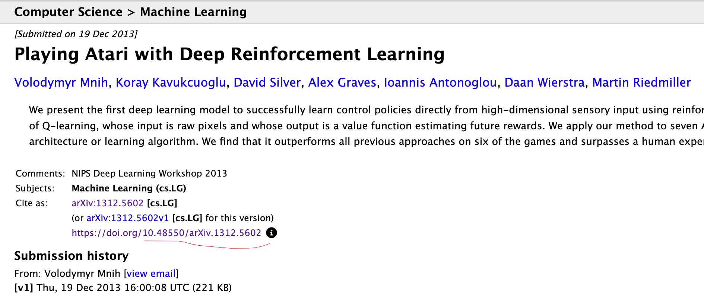

## 安装依赖

首先安装一些必要的依赖：

```bash
pip install bibtexparser urllib mdutils
```

## 手动写入doi.txt文件

然后在当前目录下新建一个文件`doi.txt`，

每行写上DOI、论文算法简称(如有，比如DQN)以及论文对应的会议简称(如有，比如NIPS)，中间用逗号隔开。

注意txt格式不要有问题，否则容易出错！！！比如中间多出空白行，多余的空格等等，按照我给的示例文件来！！！

DOI号怎么查可自行搜索，这里举一个arxiv的例子，如下图：



可以看到`https://doi.org/`后面的都是doi号，即`10.48550/arXiv.1312.5602`，其他网站只要是正规的论文都能轻松找到。

## 输出md文件

写好之后`python main.py`就可以输出`output.md`文件，如下：


这个样式就是我规定的样式。